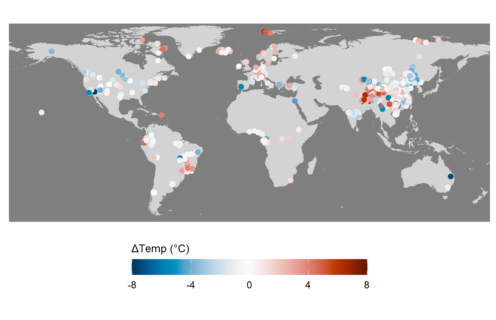
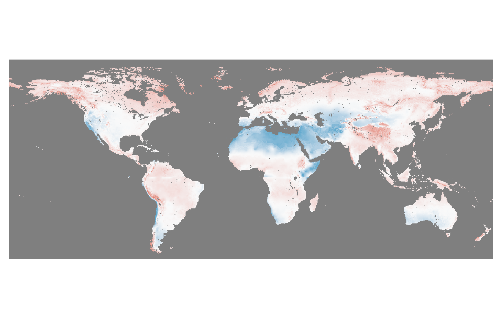
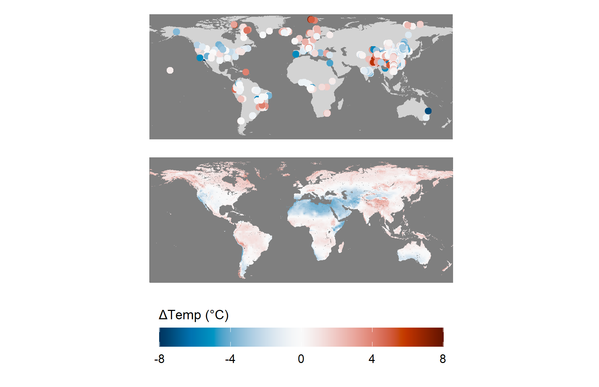

# Global brGDGT ΔTemp Mapping

## 1. Data Import and Preprocessing

```{r setup, include=FALSE}
knitr::opts_chunk$set(echo = TRUE, warning = FALSE, message = FALSE)
library(readxl)
library(ggplot2)
library(sf)
library(rnaturalearth)
library(rnaturalearthdata)
library(terra)
library(tidyterra)
library(patchwork)
```

```{r read-data}
df <- read_excel("gloabl soil brGDGT dataset - v2.xlsx", sheet = " Temperature_Comparison", .name_repair = "minimal")
df_clean0 <- df[, c("Latitude_degN", "Longitude_degE", "deltaMAF-WC bnn")]
df_clean <- na.omit(df_clean0)
colnames(df_clean) <- c("lat", "lon", "delta")
```

## 2. Map Visualization

```{r Map Visualization}
tif <- rast("delta_temp.tif")
names(tif) <- "delta_temp"
world <- ne_countries(scale = "medium", returnclass = "sf")
xlim <- c(-180, 180)
ylim <- c(-60, 85)
rd_bu <- rev(hcl.colors(100, "RdBu"))
```

### 2.1 Scatter Map (Observed Data)

```{r  Scatter Map}
p1 <- ggplot() +
  geom_rect(aes(xmin = -180, xmax = 180, ymin = -60, ymax = 85), fill = "#7f7f7f") +
  geom_sf(data = world, fill = "lightgray", color = NA) +
  geom_point(data = df_clean, aes(x = lon, y = lat, color = delta), size = 2) +
  scale_color_gradientn(
    colors = rd_bu,
    limits = c(-8, 8),
    name = "ΔTemp (°C)",
    guide = guide_colorbar(
      barwidth = 15,
      barheight = 1,
      title.position = "top",
      title.theme = element_text(size = 10, face = "plain"),
      label.theme = element_text(size = 9)
    )
  ) +
  coord_sf(xlim = xlim, ylim = ylim, expand = FALSE) +
  theme_minimal() +
  theme(
    axis.title = element_blank(),
    axis.text = element_blank(),
    axis.ticks = element_blank(),
    legend.position = "bottom"
  )
p1
```

](figures/p1.png)

### 2.2 Raster Map (Predicted Data)

```{r Raster Map}
p2 <- ggplot() +
  geom_rect(aes(xmin = -180, xmax = 180, ymin = -60, ymax = 85)) +
  geom_spatraster(data = tif) +
  scale_fill_gradientn(colors = rd_bu, limits = c(-8, 8), guide = "none") +
  coord_sf(xlim = xlim, ylim = ylim, expand = FALSE) +
  theme_minimal() +
  theme(
    axis.title = element_blank(),
    axis.text = element_blank(),
    axis.ticks = element_blank(),
    legend.position = "none"  
  )
```




## 

## 3. Combine and Export Figures

```{r Combine and Export Figures}
combined <- (p1 / p2) + plot_layout(guides = "collect") & theme(legend.position = "bottom")
combined
```


